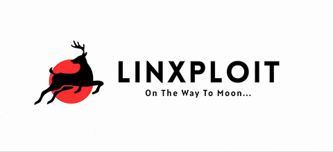

  

  
  
  

  <a href="https://linxploit.com"><b>linxploit.com</b></a> &nbsp;·&nbsp;
  <a href="https://linxploit.com/founder"><b>linxploit.com/founder</b></a> &nbsp;·&nbsp;
  <a href="https://github.com/linxploit"><b>github.com/linxploit</b></a>

 

  

 

<!-- ============================================================ -->
<!--  ABOUT ME                                                     -->
<!-- ============================================================ -->

  

 

**I'm Mindless — Founder & CEO of [Linxploit](https://linxploit.com).**

I build security tools. Specifically, tools that stay on the right side of a line a lot of "recon" and "pentest" scripts blur without thinking about it — every release documents exactly what it does and doesn't do, ships with an authorization gate before it touches a target, and is built to survive contact with a real engagement rather than just look good in a demo GIF.

**What I focus on:**

- Designing and building the **Linxploit toolkit** — open-source, safe-by-design utilities for web application security testing, reconnaissance, and infrastructure assessment
- Reading and reasoning about the internals most tools skim past — TLS handshakes, HTTP header semantics, CORS origin-validation logic, WHOIS/registry data — well enough to build something that gets the details right, not just the headline feature
- Writing tools that are honest about their limitations: a detection is a signal for a human to review, not a verdict

**How I work:**

Every tool I ship starts from the same brief — solve one problem cleanly, explain exactly how it works, and never pretend a passive check is proof of anything. I'd rather release something smaller that's correct than something impressive that's wrong in a way nobody notices until it matters.

**Currently:** building out the Linxploit toolkit, one focused tool at a time, and open-sourcing all of it.

 

<!-- ============================================================ -->
<!--  AREAS OF FOCUS                                               -->
<!-- ============================================================ -->

  

 

| | |
|---|---|
| **🔍 Web Application Security** XSS reflection analysis, CORS misconfiguration testing, upload-form attack-surface review, HTTP security header auditing. | **🌐 Reconnaissance & OSINT** Directory & endpoint discovery, domain/WHOIS intelligence, technology stack fingerprinting. |
| **🔐 TLS / PKI** Certificate inspection, protocol-support testing, key & signature strength analysis. | **🛠️ Tool Development** Turning each of the above into clean, documented, open-source CLI tools others can actually rely on. |

 

<!-- ============================================================ -->
<!--  TOOLBOX                                                     -->
<!-- ============================================================ -->

  

 

<b>Languages & Development</b>

  
  
  
  
  
  
  
  

<b>Platforms & Environment</b>

  
  
  
  
  
  

<b>Security & Offensive Tooling</b>

  
  
  
  
  
  

<b>Data & Monitoring</b>

  
  
  
  

<!-- ============================================================ -->
<!--  OPEN SOURCE WORK                                             -->
<!-- ============================================================ -->

  

A selection of tools built and released under Linxploit — each one open-source, documented, and scoped to a single problem done properly.

 

  

    
    
  

  

    
    
  

  

    
    
  

  

    
    
  

  

    
    
  

  

    
  

<!--
  NOTE: pin cards render correctly only once each repo exists under
  github.com/linxploit with the exact name in &repo= above.
-->

  <a href="https://github.com/linxploit?tab=repositories"><b>→ See all repositories</b></a>

<!-- ============================================================ -->
<!--  CTF & ACHIEVEMENTS                                          -->
<!-- ============================================================ -->

  

 

  
  &nbsp;&nbsp;
  

<!-- ============================================================ -->
<!--  CONNECT                                                      -->
<!-- ============================================================ -->

  

 

  
  
  

Open an issue on any repo if you have questions about a tool — feedback and contributions are always welcome.

<!-- ============================================================ -->
<!--  GITHUB STATS                                                -->
<!-- ============================================================ -->

  

 

  
  

 

  

<!-- ============================================================ -->
<!--  FOOTER                                                      -->
<!-- ============================================================ -->

  

  
  &nbsp;&nbsp;
  
  &nbsp;&nbsp;
  

